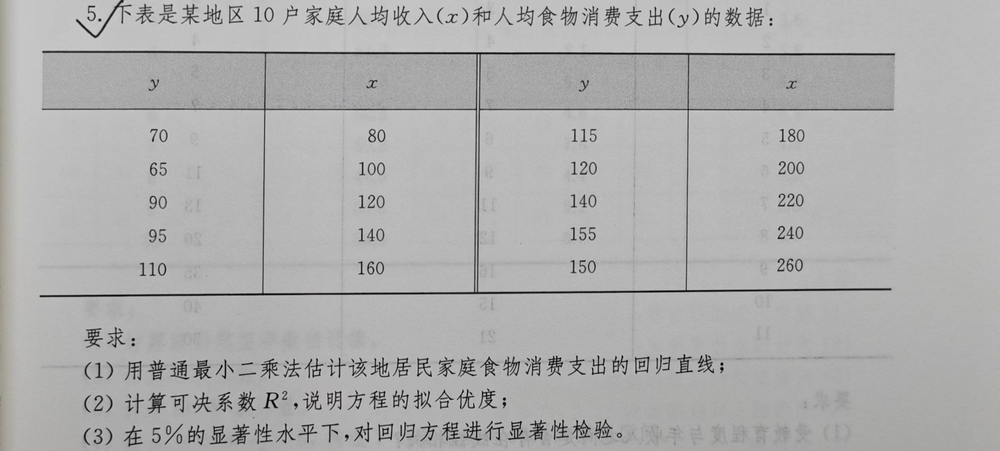
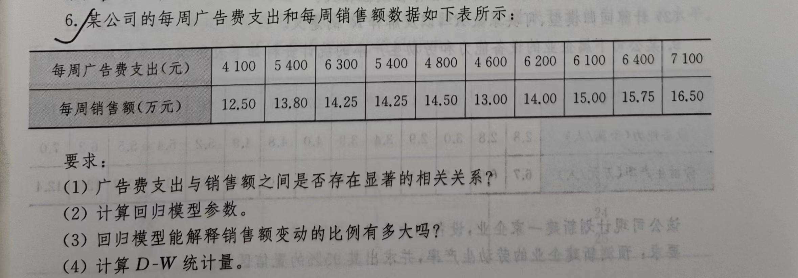
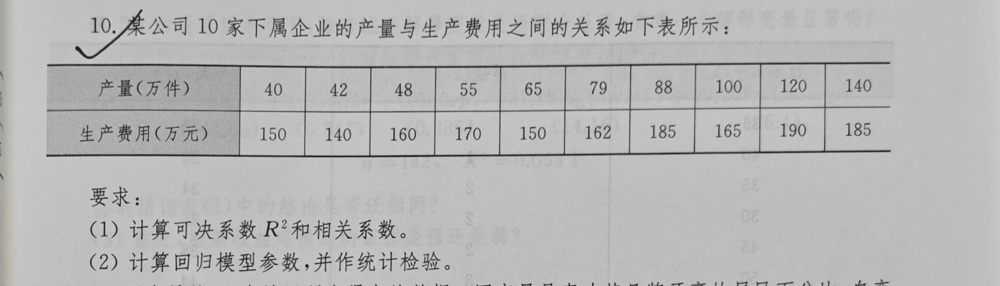

### 统计预测与决策__作业一
collapsed:: true
	- ## 1. 简要概述统计预测的方法分类和主要步骤:
		- ### 方法分类：
			- 定性方法
			- 回归预测方法
			- 时间序列预测
		- ### 主要步骤：
			- **确定预测的目的：** 预测的目的不同,所需的资料和采用的预测方法也有所不同。例如,对人民群众生活水平,既可从其收人方面来预测,也可从其消费结构方面来预测,还可从物价变动对其生活的影响程度等方面来预测。有了明确的目的,才能据以搜集必要的统计资料,采用合适的统计预测方法。
			- **搜集和审核资料：** 准确的统计资料是统计预测的基础。预测之前,必须掌握大量的、全面的、准确有用的数据和情况。为了保证统计资料的准确性,还必须对资料进行审核、调整和推算。对审核、调整后的资料,要进行初步分析,画出统计图形,以观察统计数据的性质和分布,作为选择适当预测模型的依据。
			- **选择预测模型和方法：** 资料审核、调整后,根据资料结构的性质,选择合适的模型和方法来预测。在资料不够完备、精度要求不高时,可采用定性预测法;在掌握的资料比较完备、进行比较精确的预测时,可运用一定的数学模型,如采用回归预测法和时间序列预测法等。
			- **分析预测误差，改进预测模型：** 预测误差是预测值与实际观察值之间的离差,其大小与预测准确程度的高低成反比。预测误叁虽然不可避免,但若超出了允许范围,就要分析产生误差的原因,以决定是否需要对预测模型和预测方法加以修正。
			- **提出预测报告：** 即把预测的最终结果编制成文件和报告,向有关部门上报或以一定的形式对外公布,国提供和发布预测信息,供有关部门和企业在决策时参考和应用。
	- ## 2. 举例身边用到或者可能用预测模型解决的实际问题和场景,要求每一个描述少于80字。
		- 假设一个饭店想要提高菜品的口碑和满意度。饭店经理可以通过定性方法来预测不同菜品的受欢迎程度。经理可以根据自己的经验和直觉，结合顾客的反馈和口味偏好，对菜品进行评估和预测。比如，经理可能会根据菜品的外观、香气、口感等因素，判断哪些菜品更有可能受到顾客的喜爱。然后，经理可以根据这些预测结果，进行菜单调整，提高菜品的口碑和满意度。这就用到了定性预测法，通过主观判断和分析来对事物进行评估和预测的方法。它不依赖于具体的数值数据，而是根据观察者的经验、专业知识和直觉来做出判断。
		- 假设一个公司想要预测某个产品的销售量。公司可以使用回归预测方法来建立一个销售量与各种因素（如价格、广告投入、竞争对手的销售量等）之间的数学模型。公司可以收集历史销售数据和其他相关因素的数据，并利用回归分析来找出这些因素与销售量之间的关系。然后，公司可以使用这个模型来预测未来某个时间点的销售量，从而进行销售策略的制定和优化。这就用到了回归预测方法，通过建立数学模型，分析自变量与因变量之间的关系，来预测未来的数值。
		- 假设一个电力公司想要预测未来一周的电力负荷。公司可以使用时间序列预测方法来分析过去几个月或几年的电力负荷数据，找出其中的趋势和季节性模式。然后，公司可以利用这些模式来预测未来一周的电力负荷，以便合理安排发电和供电计划，以及优化电力系统的运行。这就用到了时间序列预测，基于时间序列数据的统计分析方法，用于预测未来的趋势和模式。它假设未来的数据会受到过去数据的影响，通过分析和建模过去的数据来预测未来的数据。
- ### 统计预测与决策__作业二
  collapsed:: true
	- ## p36-五-(1) （[[德尔菲法]]）
		- （1）按8位专家第三次判断的平均值，则预测这个新产品的平均销量为：
		  $${{415+570+770} \over 3}=585（千件）$$
		- （2）将最可能销售量、最低销售量和最高销售量分别按050,0.20和0.30的概率加权平均,则预测平均
		  销售量为：
		  $$570\times 0.50+415\times 0.20+770\times 0.30=599(千件)$$
		- （3）用中位数计算,可将第三次判断按预测值高低排列如下:
		  最低销售量：300 370 400 500 550
		  最可能销售量：410 500 600 700 750
		  最高销售量：600 610 650 750 800 900
		  最低销售量的中位数为第三项，即400。
		  最可能销售量的中位数为第三项，即600。
		  最高销售量的中位数为第三、第四项的平均数，即700。
		  将最可能销售量、最低销售量和最高销售量分别按0.50,0.20和0.30的概率加权平均,则预测平均销
		  售量为:
		  $$600\times 0.50+400\times 0.20+700\times 0.30=590(千件)$$
	- ## p39-六
		- 具体分析：在这一案例中,我们设计三个情景
		  **无突变情景：**
		  趋势不变,固定资产以2021年12.11%的增长趋势增长。则到2022年:固定资产投资=2452.11*(1+12.11%)=2749.06(亿元)
		  **乐观情景：**
		  政府加大投资。固定资产投资增长在2022年达到3000亿元。
		  **悲观情景：**
		  固定资产投资到2022年维持现在水平。
		- 预测首先,对历史资料建立回归方程:
		  GDP=b0+b1*固定资产投资+e
		  得到回归方程:
		  GDP=128.47+2.06*固定资产投资
		  其中R-Squared 为0.949 2,整体F检验方程高度显著
		  在第一种无突变情景下,预测 GDP为5791,53亿元
		  在第二种乐观情景下,预测 GDP为6308.47亿元。
		  在第三种悲观情景下,预测 GDP 仍然为5179.82亿元。
- ### 统计预测与决策_作业三
	- 
		- (1) : $n=10$，经计算得：
		  $\sum x=1700$    $\sum x^{2}=322000$     $\sum xy=205500$    $\sum y =1110$     $\sum y^{2} =132100$
		  $$\hat{b_{1}}={{\sum(x- \overline{x})(y- \overline{y})} \over{\sum(x- \overline{x})^{2}} }= {{n \sum{xy}-\sum{x} \sum{y}} \over{n \sum{x^{2}}-( \sum x)^{2}}}={{10 \times 205500-1700 \times 1110} \over {10 \times 322000 -1700^{2}}} \approx 0.5091$$
		  $$\hat{b_{0}}= {\overline{y} - \hat{b_{1}} \overline{x}}={{{1110} \over{10}} -0.5091 \times{{1700} \over{10}}} \approx 24.453$$
		  因此，建立的一元线性回归方程为：
		  $$\hat{y} = 24.453+0.5091 \times x$$
		- (2): 计算可决系数
		  $$R^{2}= {{{\overline{b}_{1}^{2}} \sum{\left( x - \overline{x} \right)}^{2}} \over{\sum{\left( y - \overline{y} \right)}^{2}}}={{\overline{b}_{1}^{2}(\sum{x^{2}-n \overline{x}^{2}})} \over {\sum{y^{2}-n \hat{y}^{2}}}}={{0.5091^{2} \times (322000-10 \times 170^{2})} \over {132100-10 \times 111^{2}}} 
		  \approx {0.9621}$$
		- (3): 模型的显著性检验统计量
		  $$F={{R^{2}(n-2)} \over {1-R^{2}}}={{0.9621 \times 8} \over {1-0.9621}} \approx 253.8522$$
		  $$t \approx 14.25>t_{0.025}(8)$$
		  所以拒绝原假设，认为所建立的线性回归模型是显著的。
		  ---
	- 
		- (1) :$n=10$，经计算得：
		  $\sum x=56400$    $\sum x^{2}=32604000$     $\sum xy=818145.0$  $\sum y =143.55$   $\sum y^{2} =2073.3775$
		  $$r={{\sum(x- \overline{x})(x- \overline{x})} \over \sqrt{\sum(x- \overline{x})^{2} \sum(y- \overline{y})^{2}}} \approx 0.848$$
		- (2):
		  $$\hat{b_{1}}={{\sum(x- \overline{x})(y- \overline{y})} \over{\sum(x- \overline{x})^{2}} } \approx 0.00107$$
		  $$\hat{b_{0}}= {\overline{y} - \hat{b_{1}} \overline{x}} \approx 8.304$$
		  因此，建立的一元线性回归方程为：
		  $$\hat{y} = 8.304+ 0.00107 \times x$$
		- (3): 
		  $$R^{2}= {{{\overline{b}_{1}^{2}} \sum{\left( x - \overline{x} \right)}^{2}} \over{\sum{\left( y - \overline{y} \right)}^{2}}} \approx 0.719$$
		- (4): D-W值为1.5620239997734038
		  ---
	- {:height 201, :width 675}
		- (1) : $n=10$，经计算得：
		  $\sum x=777$    $\sum x^{2}=70903$     $\sum xy=132938$    $\sum y =1657$   $\sum y^{2} =277119$
		  $$r={{\sum(x- \overline{x})(x- \overline{x})} \over \sqrt{\sum(x- \overline{x})^{2} \sum(y- \overline{y})^{2}}} \approx 0.8078$$
		  $$R^{2} \approx 0.6525$$
		- (2):
		  $$\hat{b_{1}}={{\sum(x- \overline{x})(y- \overline{y})} \over{\sum(x- \overline{x})^{2}} } \approx  0.3978$$
		  $$\hat{b_{0}}= {\overline{y} - \hat{b_{1}} \overline{x}} \approx 134.7892$$
		  因此，建立的一元线性回归方程为：
		  $$\hat{y} = 134.7892+ 0.3978 \times x$$
		  模型的显著性检验统计量
		  $$F={{R^{2}(n-2)} \over {1-R^{2}}}={{0.6525 \times 8} \over {1-0.6525}} \approx 15.0206$$
		  $$t \approx 3.8756>t_{0.025}(8)$$
		  拒绝原假设，在 $\alpha=0.05$下认为所建立的线性回归模型是显著的。
		  ---
	- 一元线性模型相关参数求解程序
	  ````python
	  import numpy as np
	  import statsmodels.api as sm
	  from sklearn.linear_model import LinearRegression
	  from sklearn.metrics import r2_score
	  
	  
	  def calculate_r2(x, y):
	      # 将x和y转换为numpy数组并进行reshape
	      x = np.array(x).reshape(-1, 1)
	      y = np.array(y).reshape(-1, 1)
	  
	      # 创建线性回归模型
	      model = LinearRegression()
	  
	      # 拟合模型
	      model.fit(x, y)
	  
	      # 预测y值
	      y_pred = model.predict(x)
	  
	      # 计算R^2值
	      r2 = r2_score(y, y_pred)
	      return r2
	      
	  def calculate_dw(x, y):
	      # 将x和y转换为numpy数组
	      x = np.array(x)
	      y = np.array(y)
	  
	      # 添加常数列
	      X = sm.add_constant(x)
	  
	      # 创建OLS模型
	      model = sm.OLS(y, X)
	  
	      # 拟合模型
	      results = model.fit()
	  
	      # 提取残差
	      residuals = results.resid
	  
	      # 计算D-W值
	      dw = np.sum(np.diff(residuals) ** 2) / np.sum(residuals ** 2)
	  
	      return dw
	      
	  # 两个数组分别代表x和y的值
	  # x = [4100,5400,6300,5400,4800,4600,6200,6100,6400,7100]
	  # y = [12.50,13.80,14.25,14.25,14.50,13.00,14.00,15.00,15.75,16.50]
	  x=[40,42,48,55,65,79,88,100,120,140]
	  y=[150,140,160,170,150,162,185,165,190,185]
	  
	  X=0
	  XX=0
	  Y=0
	  YY=0
	  XY=0
	  for i in range(10):
	     X+=x[i]
	     XX+=x[i]*x[i]
	     Y+=y[i]
	     YY+=y[i]**2
	     XY+=x[i]*y[i]
	  
	  def linear_regression(x, y):
	      n = len(x)
	      x_mean = np.mean(x)
	      y_mean = np.mean(y)
	  
	      # 计算回归系数
	      numerator = np.sum((x - x_mean) * (y - y_mean))
	      denominator = np.sum((x - x_mean) ** 2)
	      slope = numerator / denominator
	      intercept = y_mean - slope * x_mean
	  
	      return slope, intercept
	  
	  # 使用numpy的corrcoef函数计算相关系数
	  r = np.corrcoef(x, y)[0, 1]
	  
	  r2 = calculate_r2(x, y)
	  print("R^2值:", r2)
	  
	  r = np.corrcoef(x, y)[0, 1]
	  
	  print("相关系数r为:", r)
	  
	  x = np.array(x)
	  y = np.array(y)
	  print("X:",X)
	  print("Y:",Y)
	  print("XX:",XX)
	  print("YY:",YY)
	  print("XY:",XY)
	  
	  # 计算回归系数
	  slope, intercept = linear_regression(x, y)
	  
	  print("回归系数（斜率）：", slope)
	  print("回归系数（截距）：", intercept)
	  
	  # 计算D-W值
	  dw = calculate_dw(x, y)
	  print("D-W值:", dw)
	  
	  f=r2*(len(x)-2)/(1-r2)
	  print("F:",f)
	  t=f**0.5
	  print("t:",t)
	  ```
- ### 统计预测与决策_作业四
  id:: 653406b3-4ca3-476f-843f-08fdc6fb25d6
	- 五-3
	  
		- 画曲线图
		  ```python
		  import matplotlib.pyplot as plt
		  import numpy as np
		  
		  x_axis_data = [1,2,3,4,5,6,7] #x
		  y_axis_data = [1,2,3,4,5,6,7] #y
		  
		  plt.plot(x_axis_data, y_axis_data, 'b*--', alpha=0.5, linewidth=1, label='acc')#'bo-'表示蓝色实线，数据点实心原点标注
		  ## plot中参数的含义分别是横轴值，纵轴值，线的形状（'s'方块,'o'实心圆点，'*'五角星   ...，颜色，透明度,线的宽度和标签 ，
		  
		  plt.legend()  #显示上面的label
		  plt.xlabel('time') #x_label
		  plt.ylabel('number')#y_label
		   
		  #plt.ylim(-1,1)#仅设置y轴坐标范围
		  plt.show()
		  ```
		-
		- 
		  大致符合一次或二次线性方程曲线。
		- 一次线性方程拟合
		  logseq.order-list-type:: number
		  $$\hat y_{t}=b_{0}+b_{1}t$$
		  输入程序一中结果如下
		- 二次线性方程拟合
		  logseq.order-list-type:: number
		  $$\hat y_{t}=b_{0}+b_{1}t+b_{2}t^{2}$$
		  输入程序二中结果如下
		- 预测结果如下
	- 五-4
	  
	- 画散点图
	  
	  大致符合二次函数曲线
	- 二次线性方程拟合
	  $$\hat y_{t}=b_{0}+b_{1}t+b_{2}t^{2}$$
	  输入程序二中结果如下
	- 预测结果如下
	- 六
	  
	- 一次线性方程拟合
	  logseq.order-list-type:: number
	  $$\hat y_{t}=b_{0}+b_{1}t$$
	  输入程序一中结果如下
	- 二次线性方程拟合
	  logseq.order-list-type:: number
	  $$\hat y_{t}=b_{0}+b_{1}t+b_{2}t^{2}$$
	  输入程序二中结果如下
	- 预测结果如下
-
-